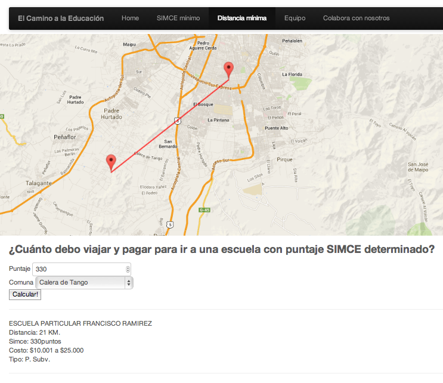

#Installation

```bash
$ git clone https://github.com/alangrafu/mapa-educacion
```

#How to use this

Initially, mapa-educacion was developed during the [Inria Chile / Open News scrapaton](http://www.meetup.com/HacksHackersChile/events/121553142/). Thus, it was left as a hack, without nice documentation like this.

There are two main visualizations, the first one is most likely to be reused, the second one seems too custom.

##Filter points by threshold

The initial goal of this visualization was to identify certain schools that showed results higher than a specific value in a standarized test. The user can move a slide in order to change the threshold, as can be seen in the following figure:


It is recommended that you modify `viz1.html` in order to start using this visualization. The parameters that can be passed to the function `init()` are:

* `url`: URL of the CSV file that will be used to obtain the data
* `mapDiv`: Id of the div element where the map will be created
* `mapCenter`: Latitude and longitude of the center of the map
* `mapZoom`: Initial zoom level for the map
* `titleField`: Column in the CSV file containing the title or name of the point that will be displayed
* `latField`: Column in the CSV file containing the latitude of the point
* `lonField`: Column in the CSV file containing the longitude of the poin
* `scoreField`: Column in the CSV file containing the score of the poin

You can call the visualization by running
```javascript
config = {
  "url": "datos.csv",
  "mapCenter": [-33.5, -70.7],
  "mapZoom": 11,
  "latField": "lat",
  "lonField": "lon",
  "titleField": "escuela",
  "scoreField": "simce",
  "mapDiv": 'map1'
};

init(config);

```

##Finding closest school

The second visualization tries to identify the closest school for a person that lives in a specific municipality. This school must have __at least__ a minimum score in the standarized test. The visualization will find the closest school that complies with both requirements.



As usual, I recommend to start modifying the HTML in order to adapt it to your needs, but basically you need to load

```javascript
  <script src="js/main2.js"></script>  
```

The parameters allowed for this visualization are:

*  `numericData`: The URL of the CSV file containing the data about the entities and their scores
*  `geoData`: The URL of the CSV file containing the data about municipalities
* `mapCenter`: The center of the map
* `mapZoom`: The initial zoom of the map
* `scoreField`: The column in the CSV file contianing the score values
* `titleField`: Column in the CSV file containing the title or name of the point that will be displayed
* `latField`: Column in the CSV file containing the latitude of the point
* `lonField`: Column in the CSV file containing the longitude of the poin
* `mapId`: The Id of the div element where the map will be created
* `runButton`: The button that will be used to start finding the closest school
* `resultDiv`: The div element where the results will be displayed